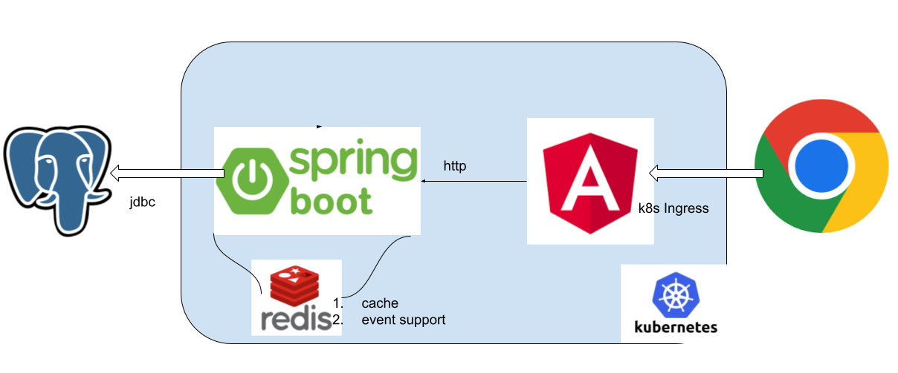

# hoteler
一个简单的入门酒店管理系统

## 架构图



## 系统功能：
1. 登录验证
2. 房态统计显示
3. 预定登记并入库
4. 入住登记并入库
5. 换房登记并入库
6. 客人信息查询
7. 退房并入库

## 初始化

### 克隆仓库

```shell script
git clone git@github.com:damingerdai/hoteler.git --recurse-submodules --remote-submodules
```

### Docker环境

1. 创建数据卷

```shell script
docker volume create --name=hoteler-volume
docker volume create --name=hoteler-redis-volume
```
2. 创建网桥

```shell script
docker network create hoteler-network
```
3. 启动数据库

```shell script
docker compose up db redis
# db uses on image, skipping
# docker-compose up --force-recreate db
```

### 数据库迁移

基于flyway的maven插件
```shell script
mvn flyway:migrate
```

基于flyway的gradle插件
```shell script
gradle flywayMigrate
```

基于golang
在migration目录中添加`.env`文件，并写入以下内容：
```shell
POSTGRES_HOST=localhost
POSTGRES_PORT=5432
POSTGRES_USER=postgres
POSTGRES_PASSWORD=123456
POSTGRES_DB=postgres
```

然后执行migrate命令
```shell script
cd migration && go build -o migrate migration.go && ./migrate up
```

### 构建

```shell script
sh scripts/build.sh
```

## 使用

### 浏览器

请访问：[http://localhost:8443](http://localhost:8080)

默认的账号密码： admin/12345


### swagger-ui

后端支持OpenApi, 请访问: [http://localhost:8443/swagger-ui/index.html?url=/v3/api-docs](http://localhost:8443/swagger-ui/index.html?url=/v3/api-docsl)

### graphql

graphql接口尚未完成
[http://localhost:8443/graphiql?path=/graphql](http://localhost:8443/graphiql?path=/graphql)

## K8S

构建数据库
```
kubectl delete namespaces hoteler-namespace
kubectl delete persistentvolumeclaim --all -n hoteler-namespace
kubectl delete persistentvolume --all -n hoteler-namespace
kubectl apply -f db.yaml
kubectl apply -f app.yaml
kubectl port-forward --namespace hoteler-namespace service/postgres 5432:5432 --insecure-skip-tls-verify
kubectl port-forward --namespace hoteler-namespace service/hoteler-web 4200:80 --insecure-skip-tls-verify
```


# 鸣谢

[](https://jb.gg/OpenSourceSupport)